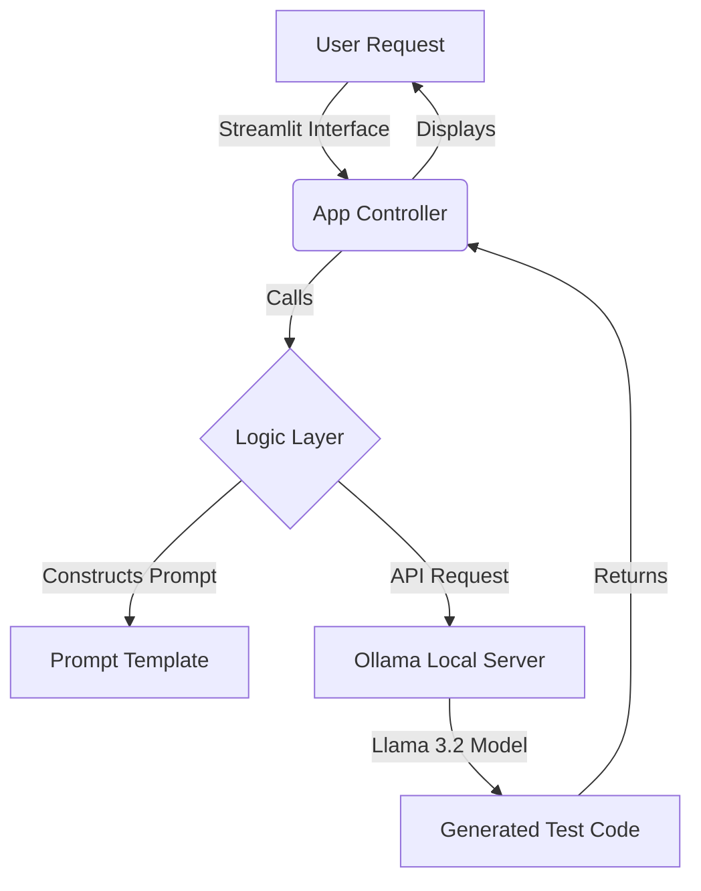

# 🧪 Local LLM Test Case Generator

## 🚀 Overview
**Local LLM Test Case Generator** is a fast, privacy-focused tool that automatically generates comprehensive Python unit tests (`unittest` or `pytest`) for your code provided via a chat interface. It leverages **Ollama** running locally with the **Llama 3.2** model, ensuring that your code logic never leaves your machine.

Start writing robust tests in seconds, not minutes.

## 🏗️ Architecture
This project follows the **B.L.A.S.T.** (Blueprint, Link, Architect, Stylize, Trigger) protocol for deterministic AI development.



## ✨ Features
*   **100% Local & Private:** Uses Ollama and Llama 3.2 running on your machine. No API keys or cloud costs.
*   **Interactive Chat UI:** Built with Streamlit for a clean, premium "ChatGPT-like" experience.
*   **Instant Feedback:** Generates ready-to-use Python test suites with syntax highlighting.
*   **Deterministic Logic:** Follows strict SOPs defined in `architecture/` for reliable output.

## 🛠️ Prerequisites
Before running the application, ensure you have the following installed:

1.  **Python 3.10+**
2.  **Ollama**: [Download here](https://ollama.com)
3.  **Llama 3.2 Model**: Run the following command in your terminal:
    ```bash
    ollama pull llama3.2
    ```

## 🚀 Getting Started

### 1. Clone the Repository
```bash
git clone https://github.com/rajeshthadi/AITesting.git
cd AITesting
```

### 2. Install Dependencies
Navigate to the project folder and install the required packages:
```bash
cd Project1_LocalTestCaseGenerator
pip install streamlit
```

### 3. Run the Application
```bash
streamlit run app.py
```

### 4. Usage
1.  Open your browser to the URL shown in the terminal (usually `http://localhost:8501`).
2.  Type a description of the function you want to test (e.g., "A Python function to calculate the Fibonacci sequence recursively").
3.  Copy the generated test code and run it in your project!

## 📂 Project Structure
```text
AITesting/
└── Project1_LocalTestCaseGenerator/
    ├── app.py                # Main Streamlit application
    ├── tools/                # Python logic for interacting with Ollama
    ├── architecture/         # System prompts and SOP definitions
    ├── BLAST.md              # Project Master System Prompt
    └── gemini.md             # Project Constitution & Data Schemas
```

---
*Generated by Antigravity*
