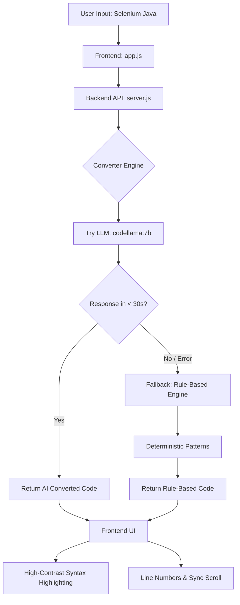

# 🔄 Selenium to Playwright Converter

Convert Selenium Java (TestNG) code to Playwright JavaScript/TypeScript using local LLM (Ollama + codellama).

## ✨ Features

- 🎯 **Full Conversion** - TestNG annotations, Selenium commands, and assertions
- 🌐 **Beautiful Web UI** - Dark-themed interface with dual code panels
- 🤖 **AI-Powered** - Uses Ollama's codellama model for intelligent conversion
- 📁 **File Export** - Download converted files instantly
- 📋 **Copy & Download** - One-click copy or download converted code
- 📊 **Conversion Report** - Detailed conversion statistics and warnings
- 🔄 **Language Toggle** - Switch between TypeScript and JavaScript output
- ⌨️ **Keyboard Shortcuts** - Efficient workflow with hotkeys

## 🚀 Quick Start

### Prerequisites

- **Node.js** >= 18.0.0
- **npm** >= 8.0.0
- **Ollama** with codellama model

### Installation

1. **Clone or navigate to the project directory**

2. **Install dependencies**
   ```bash
   npm install
   ```

3. **Ensure Ollama is running with codellama**
   ```bash
   # Check if Ollama is installed
   ollama --version
   
   # Pull codellama if not already installed
   ollama pull codellama:7b
   
   # Start Ollama (if not running)
   ollama serve
   ```

4. **Start the server**
   ```bash
   npm start
   ```

5. **Open in browser**
   ```
   http://localhost:3000
   ```

## 📂 Project Structure

```
Project2_Selenium2Playwright_UsingLocalLLM/
├── index.html              # Web UI
├── index.css               # Styling (Dark Theme)
├── app.js                  # Frontend logic
├── server.js               # Express backend
├── package.json            # Dependencies
├── architecture/           # Layer 1: SOPs
│   ├── conversion-rules.md # Conversion patterns
│   ├── llm-integration.md  # LLM integration guide
│   └── ui-design.md        # UI/UX specifications
├── tools/                  # Layer 3: Deterministic scripts
│   ├── converter.js        # Conversion engine
│   └── test-ollama-connection.js
├── output/                 # Converted files
├── test-samples/           # Sample test files
├── .tmp/                   # Temporary files
├── gemini.md              # Project Constitution
├── task_plan.md           # Task planning
├── findings.md            # Research findings
└── progress.md            # Progress log
```

## 🛠️ API Endpoints

### `POST /api/convert`
Convert Selenium code to Playwright

**Request:**
```json
{
  "sourceCode": "string",
  "targetLanguage": "javascript | typescript",
  "useLLM": true
}
```

**Response:**
```json
{
  "success": true,
  "convertedCode": "string",
  "method": "llm | rule-based",
  "conversionTime": 1234,
  "warnings": []
}
```

### `POST /api/save`
Save converted code to file

### `GET /api/files`
List all converted files

### `GET /api/health`
Check server and Ollama status

### `GET /api/sample`
Get sample Selenium code

## ⌨️ Keyboard Shortcuts

| Shortcut | Action |
|----------|--------|
| `Ctrl + Enter` | Convert code |
| `Ctrl + K` | Clear all |
| `Ctrl + S` | Download output |
| `Ctrl + C` | Copy output (when focused) |
| `Ctrl + L` | Load sample code |
| `Ctrl + /` | Toggle language (JS/TS) |

## 📋 Supported Conversions

### TestNG Annotations
- `@Test` → `test('name', async ({ page }) => {})`
- `@BeforeMethod` → `test.beforeEach()`
- `@AfterMethod` → `test.afterEach()`
- `@BeforeClass` → `test.beforeAll()`
- `@AfterClass` → `test.afterAll()`

### Selenium Locators
- `By.id("x")` → `page.locator('#x')`
- `By.className("x")` → `page.locator('.x')`
- `By.cssSelector("x")` → `page.locator('x')`
- `By.xpath("//x")` → `page.locator('//x')`
- `By.name("x")` → `page.locator('[name="x"]')`
- `By.linkText("x")` → `page.locator('a:has-text("x")')`

### Element Actions
- `.click()` → `await .click()`
- `.sendKeys("text")` → `await .fill('text')`
- `.getText()` → `await .textContent()`
- `.getAttribute("x")` → `await .getAttribute('x')`
- `.isDisplayed()` → `await .isVisible()`

### Assertions
- `Assert.assertEquals(a, b)` → `expect(a).toBe(b)`
- `Assert.assertTrue(x)` → `expect(x).toBeTruthy()`
- `Assert.assertFalse(x)` → `expect(x).toBeFalsy()`

## 🏗️ Architecture & Workflow

### 🔄 Functionality Flow


This project follows the **B.L.A.S.T.** protocol with **A.N.T.** 3-layer architecture:

### Layer 1: Architecture (SOPs)
- `architecture/conversion-rules.md` - Deterministic conversion rules
- `architecture/llm-integration.md` - LLM integration patterns
- `architecture/ui-design.md` - UI/UX specifications

### Layer 2: Navigation (This Application)
- Routes data between SOPs and Tools
- Handles user interactions
- Manages state and UI

### Layer 3: Tools (Execution)
- `tools/converter.js` - Core conversion engine
- Deterministic, testable, atomic functions
- LLM integration with fallback to rule-based

## 🧪 Testing

### Test Ollama Connection
```bash
npm run test:connection
```

### Manual Testing
1. Load sample code (Ctrl+L)
2. Click "Convert Code" or press Ctrl+Enter
3. Review converted output
4. Download or copy result

## 🔧 Configuration

### Ollama Settings
- **API URL**: `http://localhost:11434`
- **Model**: `codellama:7b`
- **Temperature**: `0.2` (for deterministic output)

### Server Settings
- **Port**: `3000`
- **CORS**: Enabled
- **Max Request Size**: 10MB

## ⚠️ Known Limitations

- Complex Selenium Actions class conversions may need manual review
- Some advanced Selenium features might not have direct Playwright equivalents
- LLM output quality depends on Ollama availability and model performance

## 🤝 Contributing

This project follows the B.L.A.S.T. protocol:
1. Update SOPs in `architecture/` before changing code
2. All tools must be deterministic and testable
3. Document changes in `progress.md`
4. Update `gemini.md` for schema or rule changes

## 📄 License

MIT

## 📞 Support

For issues or questions:
1. Check `architecture/` SOPs for guidance
2. Review `findings.md` for known issues
3. Check Ollama connection status
4. Verify codellama model is installed

---

**Powered by Ollama + codellama:7b** 🤖
